# Визуальная карта бизнес-процессов ZAGARAMI

Это короткая наглядная схема системы для заказчика.

Если нужен полный текст по каждому процессу и список вопросов для проверки, используйте также [BUSINESS_PROCESSES_AUDIT_RU.md](./BUSINESS_PROCESSES_AUDIT_RU.md).

## Как читать карту

- Слева направо показан основной путь камня и связанный путь покупателя.
- Коды `BP-xx` совпадают с кодами в полном аудиторском документе.
- Пунктиром отмечены процессы, которые поддерживают основную цепочку, но не являются одним шагом пути товара.

## 1. Общий путь товара и клиента

```mermaid
flowchart LR
    subgraph Setup["1. Подготовка каталога"]
        BP06["BP-06 Локации"]
        BP07["BP-07 Товарные шаблоны"]
        BP08["BP-08 Публикация товара"]
    end

    subgraph Collection["2. Сбор и отправка"]
        BP09["BP-09 Задача на сбор"]
        BP10["BP-10 Принятие задачи"]
        BP11["BP-11 Создание партии"]
    end

    subgraph HQ["3. Приемка и подготовка к продаже"]
        BP12["BP-12 Получение партии"]
        BP13["BP-13 Проверка камней"]
        BP14["BP-14 Фото и видео"]
        BP15["BP-15 Монтаж видео"]
        BP16["BP-16 QR и цифровой паспорт"]
        BP17["BP-17 Завершение партии"]
        BP18["BP-18 Складской контроль"]
        BP19["BP-19 Вывод в продажу"]
    end

    subgraph Customer["4. Продажа и клиент"]
        BP02["BP-02 Регистрация покупателя"]
        BP03["BP-03 Просмотр витрины"]
        BP04["BP-04 Заявка на покупку"]
        BP05["BP-05 Обработка заказа"]
        BP20["BP-20 Паспорт и активация"]
    end

    subgraph Support["Сквозные процессы"]
        BP01["BP-01 Доступ и роли"]
        BP21["BP-21 Финансы партнера"]
        BP22["BP-22 Пользователи и роли"]
        BP23["BP-23 Тексты цифрового паспорта"]
        BP24["BP-24 Языки и переводы"]
        BP25["BP-25 Дашборды и контроль"]
    end

    BP06 --> BP07 --> BP08
    BP07 --> BP09 --> BP10 --> BP11 --> BP12 --> BP13 --> BP14 --> BP15 --> BP16 --> BP17 --> BP18 --> BP19
    BP08 --> BP03
    BP19 --> BP03
    BP02 --> BP04
    BP03 --> BP04 --> BP05 --> BP20
    BP16 --> BP20

    BP22 -. "задает роли и доступ" .-> BP01
    BP01 -. "ограничивает вход" .-> BP02
    BP01 -. "ограничивает вход" .-> BP09
    BP01 -. "ограничивает вход" .-> BP12
    BP23 -. "оформляет страницу" .-> BP20
    BP24 -. "влияет на тексты" .-> BP03
    BP24 -. "влияет на тексты" .-> BP20
    BP25 -. "показывает состояние" .-> BP09
    BP25 -. "показывает состояние" .-> BP17

    classDef setup fill:#153b2f,stroke:#4ade80,color:#ffffff;
    classDef collection fill:#243b63,stroke:#60a5fa,color:#ffffff;
    classDef hq fill:#4c1d2f,stroke:#f472b6,color:#ffffff;
    classDef customer fill:#4b3520,stroke:#f59e0b,color:#ffffff;
    classDef support fill:#1f2937,stroke:#cbd5e1,color:#ffffff;

    class BP06,BP07,BP08 setup;
    class BP09,BP10,BP11 collection;
    class BP12,BP13,BP14,BP15,BP16,BP17,BP18,BP19 hq;
    class BP02,BP03,BP04,BP05,BP20 customer;
    class BP01,BP21,BP22,BP23,BP24,BP25 support;
```

## 2. Кто в какой части процесса работает

```mermaid
flowchart TB
    subgraph Public["Публичный контур"]
        P02["BP-02 Регистрация и вход"]
        P03["BP-03 Витрина"]
        P04["BP-04 Заявка на покупку"]
        P20["BP-20 Паспорт и активация"]
    end

    subgraph Partner["Контур франчайзи"]
        F10["BP-10 Принятие задачи"]
        F11["BP-11 Создание партии"]
        F21["BP-21 Финансовый кабинет"]
        F25["BP-25 Партнерский дашборд"]
    end

    subgraph HQ["Контур центрального офиса"]
        H05["BP-05 Обработка заказов"]
        H06["BP-06 Локации"]
        H07["BP-07 Товарные шаблоны"]
        H08["BP-08 Публикация товара"]
        H09["BP-09 Задача на сбор"]
        H12["BP-12 Получение партии"]
        H13["BP-13 Приемка"]
        H14["BP-14 Фото и видео"]
        H15["BP-15 Монтаж видео"]
        H16["BP-16 QR и паспорт"]
        H17["BP-17 Завершение партии"]
        H18["BP-18 Склад"]
        H19["BP-19 Канал продажи"]
        H22["BP-22 Пользователи"]
        H23["BP-23 Тексты паспорта"]
        H24["BP-24 Переводы"]
        H25["BP-25 HQ-дашборд"]
    end

    subgraph Control["Общий контур управления"]
        C01["BP-01 Доступ и роли"]
    end

    H09 --> F10 --> F11 --> H12
    H08 --> P03
    H19 --> P03
    P02 --> P04 --> H05
    H16 --> P20
    C01 -. "контролирует доступ" .-> P02
    C01 -. "контролирует доступ" .-> F10
    C01 -. "контролирует доступ" .-> H06

    classDef public fill:#4b3520,stroke:#f59e0b,color:#ffffff;
    classDef partner fill:#243b63,stroke:#60a5fa,color:#ffffff;
    classDef hq fill:#4c1d2f,stroke:#f472b6,color:#ffffff;
    classDef control fill:#1f2937,stroke:#cbd5e1,color:#ffffff;

    class P02,P03,P04,P20 public;
    class F10,F11,F21,F25 partner;
    class H05,H06,H07,H08,H09,H12,H13,H14,H15,H16,H17,H18,H19,H22,H23,H24,H25 hq;
    class C01 control;
```

## 3. Короткое чтение схемы для заказчика

### Что видно по карте сразу

- Система уже покрывает путь от подготовки товара до проверки подлинности у конечного покупателя.
- Основная операционная нагрузка находится в контуре HQ: там создаются каталоги, ставятся задачи, принимаются партии и готовятся материалы.
- Франчайзи отвечает за выполнение задачи на сбор и передачу партии.
- Публичный контур отвечает за просмотр товара, отправку заявки и работу с цифровым паспортом.

### Где удобнее проводить аудит

- сначала проверить роли и доступы;
- затем публичную витрину и процесс заявки на покупку;
- потом блок "сбор и партия";
- затем HQ-процессы приемки, медиа, склада и вывода в продажу;
- после этого отдельно проверить цифровой паспорт и финансовый кабинет партнера.
