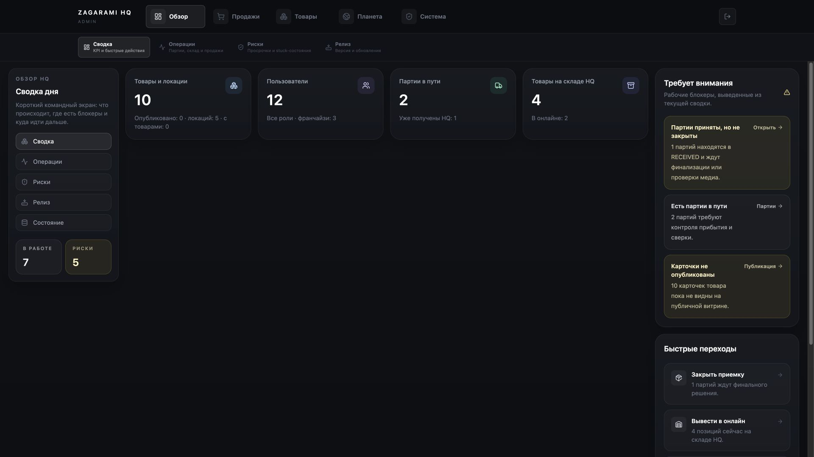
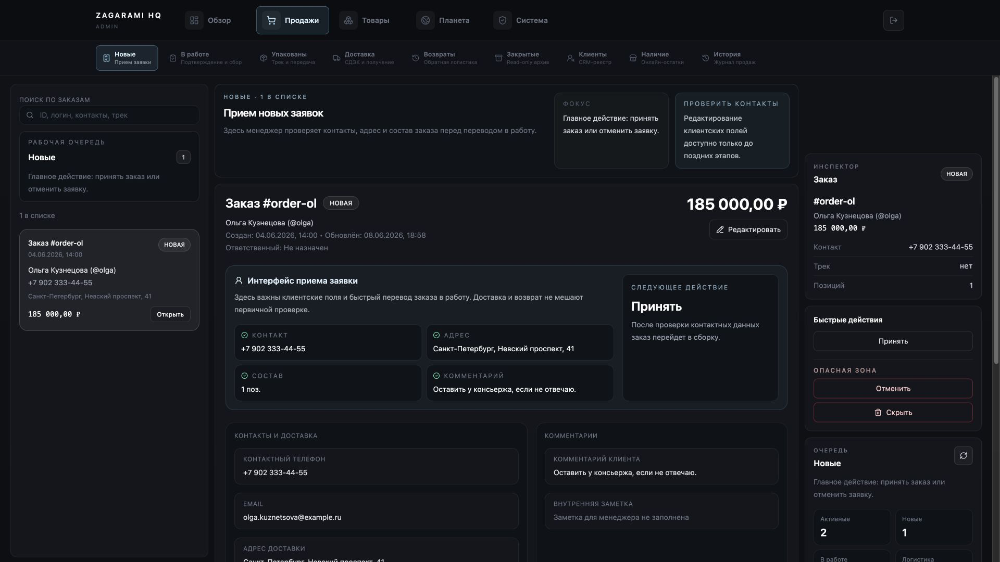
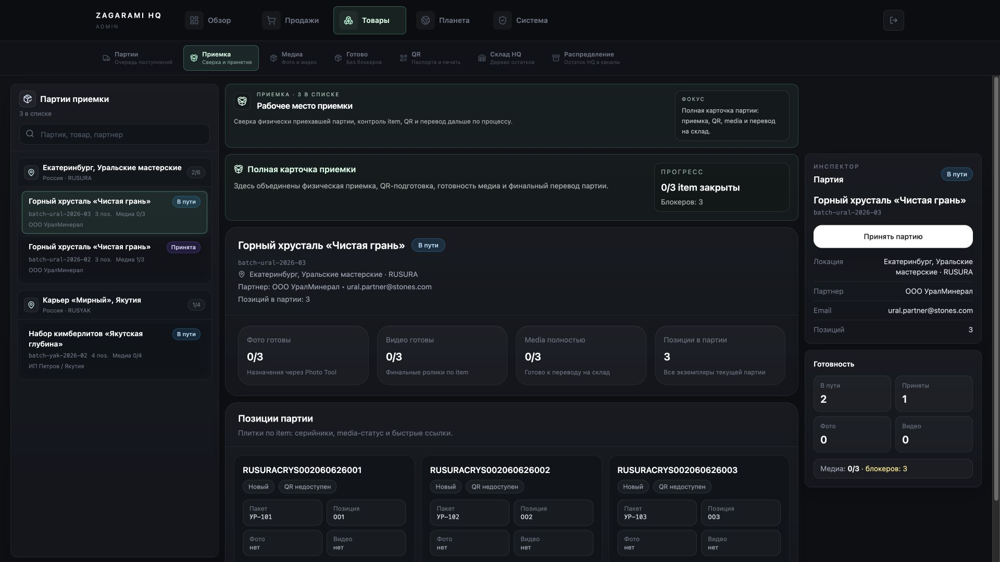
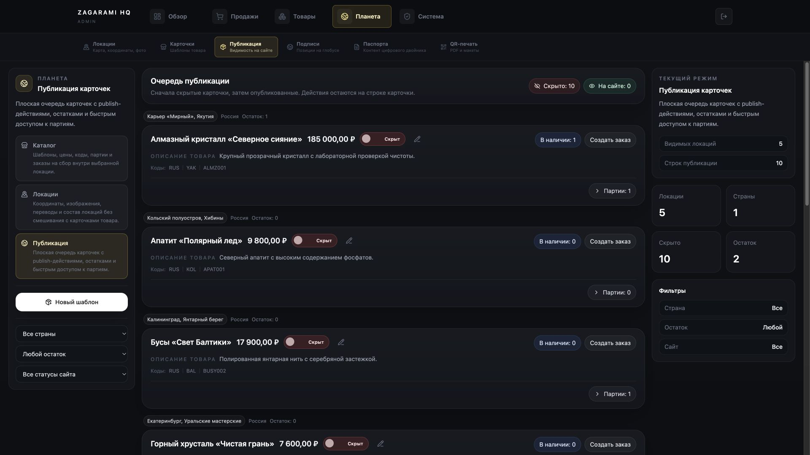
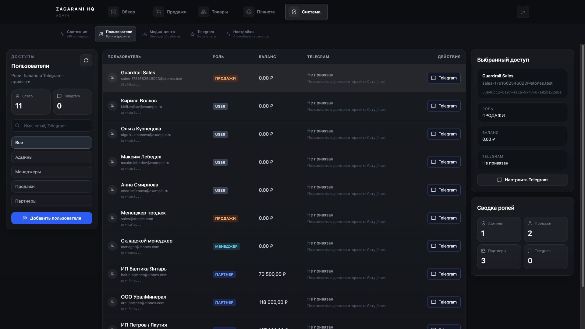

# Визуальный аудит текущей HQ-админки

## Метод

- Browser: in-app Browser, авторизованная локальная ADMIN-сессия.
- Данные: E2E seed, реальные ответы локального backend/MySQL.
- Viewports: полный проход `1440×900`; контрольный проход ключевых экранов `1920×1080`.
- Для каждого состояния сохранены DOM snapshot и screenshot, затем изображение открыто и визуально проверено.
- Mobile/tablet намеренно не проверялись.

## Общий вердикт

Визуальная проблема является следствием IA. Интерфейс тратит значительную часть экрана на:

1. два постоянных ряда навигации;
2. левую панель с повторным названием/описанием/режимами;
3. правый inspector с повтором выбранной строки и сводки;
4. большие карточки и объясняющие абзацы.

Из-за этого даже на 1920×1080 рабочий центр часто пуст или повторяет одно действие несколько раз. На 1440×900 плотные таблицы теряют колонки, а критическая информация об Item обрезается.

## Health по каждому снятому состоянию

| № | Route/state | Health | Что видно на первом экране |
|---:|---|---|---|
| 01 | `/admin` 1440 | Fail | третья навигация слева, 4 KPI-карточки, огромная пустота, длинный правый inspector |
| 02 | `/admin/operations` | Fail | «операции» — три карточки-ссылки; выполнять работу нельзя |
| 03 | `/admin/risks` | Fail | один и тот же риск повторяется в центре и справа |
| 04 | `/admin/release` | Fail | версия и ссылки занимают самостоятельный основной раздел |
| 05 | `/admin/system/status` | Critical | зеленые статусы не соответствуют реальным probes; обещание API/queues не выполнено |
| 06 | `/admin/brandbook` | Dev-only fail | скрытая страница подсвечивает неверную зону; русский/английский смешаны |
| 07 | Mega menu prototype | Partial/strong idea | workflow grouping понятнее текущего меню, но overlay чрезмерно велик и данные статичны |
| 08 | Sidebar v2 prototype | Fail | другая оболочка тех же универсальных metrics/actions |
| 09 | Workspaces prototype | Fail | каталог карточек вместо выполнения конкретной задачи |
| 10 | Physical workspace prototype | Fail | один универсальный feature template подменяет приемку/склад/медиа |
| 11 | Command matrix prototype | Fail | те же действия и числа в ещё одной упаковке |
| 12 | Focus deck prototype | Fail | те же статические блоки; визуальный вариант без нового task model |
| 13 | `/orders/new` 1440 | Fail | выбранный заказ повторяется слева/в центре/справа; `Принять` повторено; опасные действия всегда рядом |
| 14 | `/orders/in-progress` | Fail | пустое состояние заполняет три колонки инструкциями, но сборочного checklist нет |
| 15 | `/orders/packed` | Fail | этап объясняется плакатами, а трек и переход остаются в общей длинной карточке |
| 16 | `/orders/delivery` | Fail | та же форма; CDEK/получение не становятся центром задачи |
| 17 | `/orders/returns` | Fail | общая карточка и inspector; активные и завершенные возвраты визуально смешаны |
| 18 | `/orders/closed` | Critical | экран обещает read-only, но показывает edit/sync/hide controls |
| 19 | `/clients` | Partial | list-detail уместен, но правый inspector повторяет и теряет phone/address из-за contract mismatch |
| 20 | `/inventory` 1440 | Fail | central table шире доступного пространства; крайние колонки уходят во вложенный horizontal scroll |
| 21 | `/sales-history` | Fail | выглядит как ещё один архив заказов; нет периода, отчётных controls и event detail |
| 22 | `/acceptance/batches` | Fail | почти тот же экран, что базовая Acceptance; media/item blocks не убраны |
| 23 | `/acceptance` | Critical | визуально обещает ручную item-приёмку и раскрывает все Item, хотя канонический процесс автоматический и batch-level |
| 24 | `/acceptance/media` | Critical | данные показаны одновременно с красным `Не удалось загрузить партии`; false mixed state |
| 25 | `/acceptance/ready` | Fail | пустота распределена на три колонки; readiness неполна относительно backend |
| 26 | `/warehouse` | Fail | landing из больших описательных cards вместо склада; destructive actions появляются в обычном дереве |
| 27 | `/warehouse/items` | Critical | serial/название обрезаны до неразличимых `R…`; безопасно выбрать экземпляр невозможно |
| 28 | `/warehouse/maintenance` | Critical | опасные действия постоянно видимы; impact/recovery не показаны |
| 29 | `/warehouse/requests` | Fail | title/description повторены слева/в центре/справа; actionable workflow отсутствует |
| 30 | `/allocation` | Critical | сама схема selection→destination уместна, но cards не идентифицируют Item достаточно |
| 31 | `/products` | Fail | location cards обрезают названия; side panels повторяют режим; каталог скрыт за дополнительным выбором |
| 32 | `/products/locations` | Fail | card grid с наложенным текстом/кнопками, повторная сводка справа; edit/delete конкурируют |
| 33 | `/products/publication` 1440 | Fail | publication смешана с edit, create order, batches и new template; текст режима повторяется |
| 34 | `/planet-labels/workspace` | Critical | «Готово/Настроен» визуально уверенно, хотя status выведен из defaults; launcher теряет selection |
| 35 | `/clone-content` | Critical | много полей выглядит рабочими, но большинство не влияет на public view; preview узкий и перегруженный |
| 36 | `/admin/qr` | Partial | понятный batch chooser, но дублирует constructor; `PDF` на самом деле открывает editor |
| 37 | `/users` 1440 | Fail | таблица зажата; Telegram/action и selected data повторяются справа; access lifecycle отсутствует |
| 38 | `/settings` | Fail | четыре карточки описывают один файловый manager; «Настройки» фактически не существуют |
| 39 | `/settings/files` | Critical | одинаковые маленькие trash icons для файлов/папок; масштаб recursive delete не виден |
| 40 | `/telegram` empty | Fail | почти весь экран пуст; создание бота спрятано в маленьком `+`, режимы занимают левую колонку |
| 41 | `/media` | Critical | URL-gaps названы processing queue; реальные Photo/Video jobs отсутствуют |
| 42 | `/video-tool` alias | Critical | отдельная шапка и Status Center поверх той же media queue; API error соседствует с `Загружено` |
| 43 | `/media/diagnostics` | Critical | красная ошибка, нулевые counts и зеленая карточка blockers одновременно |
| 44 | `/admin` 1920 | Fail | больше ширины превращается в ещё большую пустоту; правая колонка растягивается вниз отдельно |
| 45 | `/orders/new` 1920 | Fail | `Принять`/описание задачи повторены в mode card, center card и inspector; ширина не решает дубли |
| 46 | `/inventory` 1920 | Partial | таблица помещается, но 300 rows default, пустой низ и switch-like read-only publication остаются |
| 47 | `/acceptance` 1920 | Critical | больше данных видно, но Item grid и 3 колонки делают партию на сотни Item непригодной для работы |
| 48 | `/products/publication` 1920 | Fail | unrelated `Создать заказ`, `Новый шаблон`, edit и batches остаются даже на широкой публикационной странице |
| 49 | `/users` 1920 | Fail | таблица читается, но дублированный inspector и Telegram-first модель не решают доступы |

## Репрезентативные доказательства

### 1920 не лечит пустоту Dashboard

### Заказ: одно действие повторено в трёх областях

### Партии: Item показаны там, где они не нужны

### Публикация смешана с чужими действиями

### Пользователи: доступ подменён Telegram/балансом

## Сквозные визуальные дефекты

### Иерархия

- На странице одновременно 3–5 конкурирующих заголовков: nav item, left rail title, mode banner, content title, inspector title.
- Акцентный цвет обозначает и текущий раздел, и предупреждение, и выбранную карточку, поэтому смысл цвета нестабилен.
- Большие числа показываются без операционного приоритета; конкретный blocker часто ниже fold.

### Плотность

- Радиусы `18–24px` и вложенные cards превращают таблицы/списки в презентацию.
- Боковые панели резервируются даже когда detail не выбран или уникального контента нет.
- Увеличение viewport не перераспределяет информацию: центральные пустоты растут.

### Текст

- Почти каждый пункт меню и режим содержит пояснение второй строкой.
- Видимы технические слова: `Item`, `Media`, `Hero`, `runtime`, `stuck`, `chat_id`, `batch ID`, status enums.
- Русский и английский смешаны; часть текста описывает архитектуру интерфейса (`Текущий режим`, `Инспектор`, `MVP`), а не задачу.

### Действия

- Одно primary action повторяется в центре и inspector.
- Destructive actions постоянно находятся рядом с routine workflow.
- Read-only status часто нарисован как switch/button.
- Fullscreen tools возвращают в фиксированный route, а не в исходную очередь.

### Доступность

- Вторичный текст визуально низкоконтрастен; точное WCAG-измерение требуется в design QA.
- Icon-only destructive actions не передают масштаб последствия.
- Вложенные scroll-области и длинные sticky columns осложняют keyboard navigation.
- Empty/error/success состояния визуально могут сосуществовать и противоречить друг другу.

## Что оставить из визуальной философии

1. Темный нейтральный фон и сдержанные domain accents.
2. Верхнее понимание текущей бизнес-зоны.
3. Плотные таблицы там, где требуется сравнение.
4. Выделенный fullscreen режим для сложного редактора.
5. Один заметный primary action и статусные badges — после исправления семантики.

## Visual stop gate

Нельзя переходить к restyle текущих components. Сначала фиксируются target IA, критерии и page blueprints. Исправленные концепты сравнивают batch-level очередь и навигацию, не изобретают ручную item-приёмку. Только выбранное направление переносится в код.
