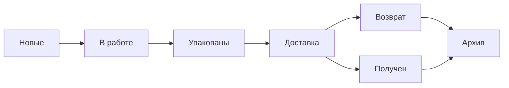
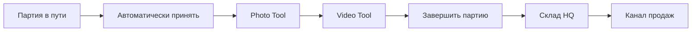
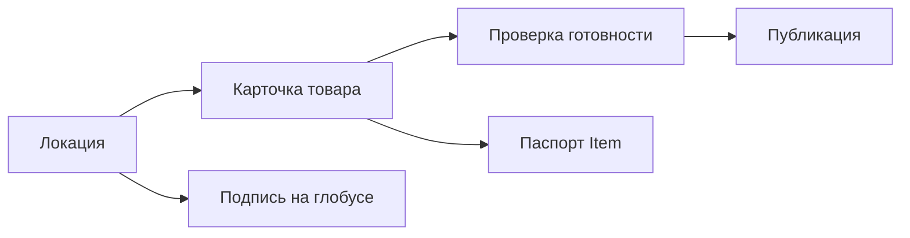

# Целевая информационная архитектура

> Процессная коррекция 2026-07-15: приёмка автоматическая, сканов нет, готовые Photo/Video workflows сохраняются. `10_PROCESS_CORRECTION.md` имеет приоритет над ранними A02-гипотезами.

## 1. Принцип навигации

Верхний уровень сохраняет удачную философию текущей версии — группировку по бизнес-зонам — но перестаёт постоянно показывать все подпункты.

| Зона | Кому | Смысл |
|---|---|---|
| Сегодня | ADMIN, MANAGER | конкретная работа и исключения текущего дня |
| Продажи | ADMIN, SALES_MANAGER | заказ от заявки до результата, клиент и наличие |
| Товары | ADMIN, MANAGER | физический путь партии и Item через HQ |
| Планета | ADMIN, MANAGER | локации, карточки и публичное представление |
| Система | по capability | доступы, уведомления, здоровье и support |

### Поведение

- глобально постоянна одна верхняя строка;
- клик по зоне открывает компактную task-map этой зоны и запоминает последнюю страницу;
- task-map содержит только короткие названия и counts реальной работы, без поясняющих абзацев;
- внутри активной зоны допускается одна компактная строка её самостоятельных бизнес-процессов;
- этапы одного процесса не дублируются в этой строке: в `Товары` видны `Партии / Заявки на сбор / Склад HQ / Распределение / QR-печать`, а приёмка, фото, видео и завершение остаются колонками `Партии`;
- routes compatibility не обязаны быть видны как пункты меню;
- глобальный быстрый переход (`Ctrl/Cmd+K`) — дополнительный, не единственный способ найти страницу.

## 2. Ролевая стартовая точка

| Роль | Start |
|---|---|
| ADMIN | `/admin` — общая очередь исключений |
| MANAGER | `/admin` — товары/поставки/медиа, отфильтрованные по capabilities |
| SALES_MANAGER | `/admin/orders/new` либо последняя доступная sales queue |

`/admin` не показывает зоны, к которым actor не имеет доступа. Сервер возвращает work items и capabilities; frontend не вычисляет права из localStorage.

## 3. Целевая карта страниц

### Сегодня

| Page | Canonical route | Назначение |
|---|---|---|
| Работа сегодня | `/admin` | единая очередь конкретных исключений с причиной, возрастом, владельцем и действием |
| Состояние системы | `/admin/system/health` | отдельная support-задача, не режим Dashboard |

Удаляются как самостоятельные страницы: `Операции`, `Риски`, `Релиз`. Их полезные данные входят соответственно в work queue или System health.

### Продажи

Глобально видимы четыре задачи: `Заказы`, `Клиенты`, `Наличие`, `Архив`.

| Page | Canonical route | Назначение |
|---|---|---|
| Новые | `/admin/orders/new` | проверить заявку и атомарно принять/зарезервировать |
| В работе | `/admin/orders/in-progress` | собрать конкретные зарезервированные Item |
| Упакованы | `/admin/orders/packed` | одним действием сохранить трек и отправить |
| Доставка | `/admin/orders/delivery` | carrier exceptions, получение или запуск возврата |
| Возвраты | `/admin/orders/returns` | только активная обратная логистика |
| Заказ | `/admin/orders/:id` | deep detail с capability-aware actions и `returnTo` |
| Клиенты | `/admin/clients` | человек, контакты и связанные заказы |
| Наличие | `/admin/inventory` | sales availability и точные Item/резервы |
| Архив | `/admin/sales-history` | event-based terminal outcomes, период и totals |

`/admin/orders` становится redirect в актуальную queue. `/admin/orders/closed` redirect в Архив.



### Товары

Task-map разделяет физический поток и справочники. Весь путь партии собран в одну batch-level очередь; Photo/Video открываются контекстно и не дублируются отдельными обзорными страницами.

| Page | Canonical route | Назначение |
|---|---|---|
| Партии | `/admin/batches` | одна очередь `В пути / Нужны фото / Нужно видео / Готовы`; агрегаты и одно следующее действие на партию |
| Склад HQ | `/admin/warehouse` | только физический складской projection |
| Заявки на сбор | `/admin/collection-requests` | управление collection workflow, не пассивный список |
| Распределение | `/admin/allocation` | безопасный bulk перевод Item в канал |
| Печать QR | `/admin/qr/print` | один fullscreen source→selection→layout→export workflow |
| Обслуживание партий | `/admin/warehouse/maintenance` | скрытая capability-gated опасная зона |

`/admin/acceptance`, `/admin/acceptance/batches`, `/admin/acceptance/media`, `/admin/acceptance/ready`, `/admin/media` и `/admin/video-tool` становятся compatibility-входами в `/admin/batches` или в конкретный fullscreen tool с `batchId/returnTo`. `/admin/warehouse/items` становится filter/preset одной warehouse table; `/admin/warehouse/requests` redirect в `/admin/collection-requests`.



Batch row никогда не раскрывает Item автоматически. Сотни Item доступны только внутри существующего Photo/Video tool или другой явно поштучной задачи.

Контекстная навигация зоны: `Партии / Заявки на сбор / Склад HQ / Распределение / QR-печать`. Она показывается одной строкой под global header на всех страницах зоны; активен ровно один пункт.

### Планета

| Page | Canonical route | Назначение |
|---|---|---|
| Локации | `/admin/locations` и `/admin/locations/:id` | list/editor текста, координат, изображения и переводов |
| Карточки | `/admin/products` | Product templates внутри локации |
| Публикация | `/admin/products/publication` | единственный write-owner видимости и readiness blockers |
| Подписи Планеты | `/admin/planet-labels` | fullscreen 3D editor с выбором location/profile внутри |
| Текст паспорта | `/admin/clone-content` | только реально используемые global copy fields + production preview |

`/admin/products/locations` становится compatibility redirect в `/admin/locations`. `/admin/planet-labels/workspace` объединяется с editor или становится redirect с `locationId/profile`. QR не дублируется в этой зоне: task-map ведёт в единую `/admin/qr/print`.

Важно: mobile profile внутри Planet editor относится к публичной Планете, а не к responsive админке. Он сохраняется до отдельного продуктового решения.



### Система

Глобально показываются `Доступ`, `Уведомления`, `Состояние`. Storage и raw support открываются только по capability/из ошибки.

| Page | Canonical route | Назначение |
|---|---|---|
| Доступ сотрудников | `/admin/access` | invite, role, suspend, sessions и desktop devices |
| Получатели | `/admin/notifications/recipients` | people-first Telegram pairing и test-send |
| Правила | `/admin/notifications/rules` | серверный каталог событий и аудитории |
| Канал Telegram | `/admin/notifications/channel` | token identity, worker/queue health, disable/delete impact |
| Состояние | `/admin/system/health` | truthful probes API/Desktop/Photo/Video/Telegram/disk |
| Хранилище | `/admin/system/storage` | support-only references, quarantine и restore |

`/admin/settings` как фиктивный overview удаляется. `Чаты` входят в подключение получателя, `Тест` — в real test-send, media runtime/diagnostics — в System health.

## 4. Fullscreen инструменты

| Tool | Route | Граница |
|---|---|---|
| QR | `/admin/qr/print` | собственный constructor, printable source, PDF |
| Planet Labels | `/admin/planet-labels` | собственная 3D-сцена |
| Photo | `/admin/photo-tool/:batchId` | одна партия, локальная Photo queue |
| Video | `/admin/video-tool/:batchId` | одна партия, Video V3 queue |

Общий entry contract:

```text
entityId/batchId, returnTo (allowlisted), returnLabel,
originFilter, originSelection, expectedRevision
```

Инструмент не показывает полный глобальный shell, но всегда имеет понятный возврат и локальный truthful progress.

## 5. Видимая task-map по ролям

### ADMIN

- Сегодня
- Продажи: Заказы, Клиенты, Наличие, Архив
- Товары: Приёмка, Медиа, Склад, Заявки, Распределение, QR
- Планета: Локации, Карточки, Публикация, Подписи, Паспорт
- Система: Доступ, Уведомления, Состояние; support по capability

### MANAGER

- Сегодня
- Товары и Планета по утверждённым capabilities
- Медиа/Photo/Video
- Состояние — только operational probes
- без access/Telegram/storage destructive, пока матрица явно не разрешит

### SALES_MANAGER

- Новые, В работе, Упакованы, Доставка, Возвраты
- Клиенты, Наличие, Архив
- default scope `Мои + неназначенные`; чужое — read-only только если продукт подтвердит

## 6. Redirect map

| Legacy | Canonical |
|---|---|
| `/admin/operations` | `/admin` |
| `/admin/risks` | `/admin?filter=attention` |
| `/admin/release` | `/admin/system/health?section=updates` |
| `/admin/system/status` | `/admin/system/health` |
| `/admin/orders` | `/admin/orders/new`/last queue |
| `/admin/orders/closed` | `/admin/sales-history` |
| `/admin/acceptance/batches|ready` | `/admin/acceptance` с filter |
| `/admin/acceptance/media` | `/admin/media` |
| `/admin/warehouse/items` | `/admin/warehouse` с filter |
| `/admin/warehouse/requests` | `/admin/collection-requests` |
| `/admin/products/locations` | `/admin/locations` |
| `/admin/qr?context=*` | `/admin/qr/print` |
| `/admin/planet-labels/workspace` | `/admin/planet-labels` |
| `/admin/video-tool` | `/admin/media` |
| `/admin/users` | `/admin/access` |
| `/admin/settings/files` | `/admin/system/storage` |
| `/admin/telegram/**` | `/admin/notifications/**` по таблице совместимости |
| `/admin/media/runtime|diagnostics` | `/admin/system/health` |

Redirects сохраняются через migration window, логируются и не создают отдельные nav items.

## 7. Что не входит в production IA

- `/admin/brandbook`;
- `/admin/prototypes/*`;
- destructive E2E diagnostics;
- raw runtime/queue/log screens без support capability;
- дублирующие query views;
- dormant `Locations.tsx` после consumer check.

## 8. IA acceptance

- не более 5 глобальных зон;
- не более 4–8 видимых задач в task-map одной зоны;
- один route — один owner;
- ни одно действие не находится в двух рабочих страницах;
- filters не выдаются за глобальные пункты;
- каждый legacy URL имеет canonical target;
- task-map каждой роли можно объяснить одной строкой;
- пользователь проходит основной workflow без возврата на Dashboard ради поиска следующей страницы.
