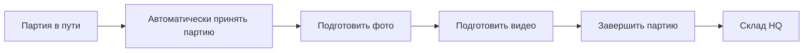

# Коррекция модели процесса — 2026-07-15

## Зафиксированное уточнение владельца продукта

Предыдущая концепция ошибочно превратила редизайн интерфейса в проектирование новой поштучной приёмки. Это направление отменено.

Канонические ограничения для дальнейшей документации и реализации:

1. Приёмка партии автоматическая. Сканов, ручного `verify`, `accept/reject` каждого Item и поштучного workbench в новой админке нет.
2. Готовые Photo Tool и Video Tool уже решают отбор/присвоение фото и монтаж/экспорт видео. Их внутренний workflow не перепроектируется.
3. Основная единица интерфейса физического потока — `Batch`, а не `Item`.
4. В партии могут быть сотни Item. Batch-list и batch-detail не загружают и не рендерят их постоянными cards/rows и не раскрывают их автоматически.
5. Item показывается только внутри задачи, где без точной идентификации Item действие невозможно:
   - назначение фото в Photo Tool;
   - монтаж/экспорт видео в Video Tool;
   - точный поиск на складе;
   - распределение, комплектация заказа или ручной выбор QR;
   - support-detail по явному запросу.
6. Текущий проект меняет интерфейс и навигацию. Существующие state transitions, media jobs и desktop runtime сохраняются.

## Исправленная модель партии

В обычной админке каждый этап представлен одной строкой партии, агрегатным прогрессом и ровно одним следующим действием. Переход в Photo/Video открывает существующий fullscreen-инструмент и возвращает в ту же строку/фильтр.

## Масштабный инвариант

Для партии любого размера основной экран хранит постоянную визуальную сложность `O(1)` на партию:

- одна строка партии;
- количество позиций;
- агрегаты фото/видео;
- этап/блокер;
- одно следующее действие.

Количество Item не увеличивает высоту строки и не создаёт сотни DOM-узлов до входа в специализированный инструмент.

## Что считается устаревшим

- три концепта поштучной приёмки, созданные до этого уточнения;
- рекомендации `scan каждого Item`;
- отдельная страница `Приёмка партии` с item table;
- трактовка неиспользуемых `/api/hq/acceptance/*` endpoints как требования к новому UI.

Старые endpoints и раздел документации о ручной item-приёмке фиксируются как legacy/расхождение источников, но не определяют UX новой админки.
