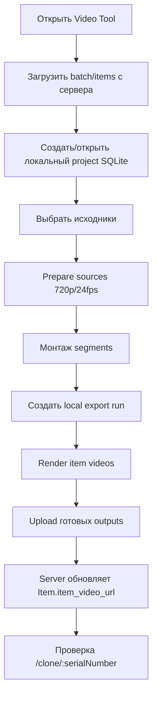
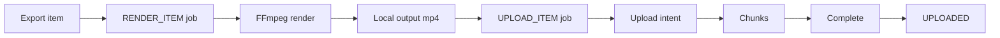
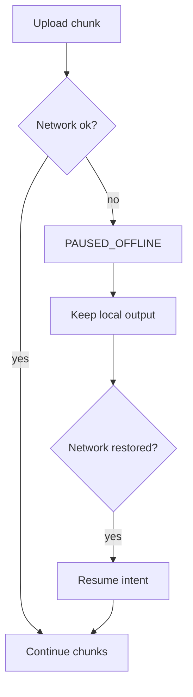
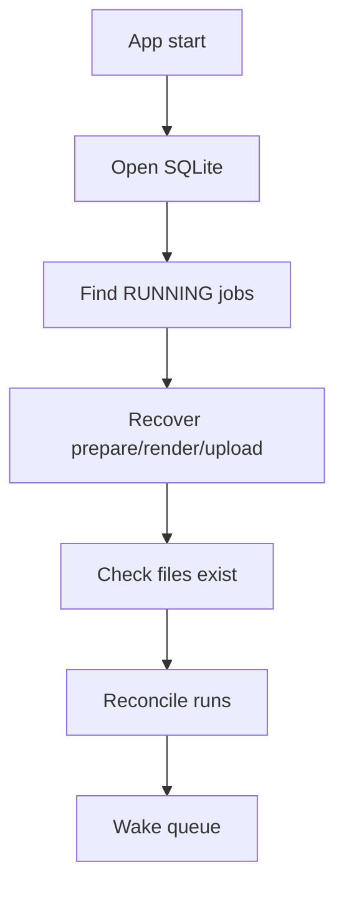
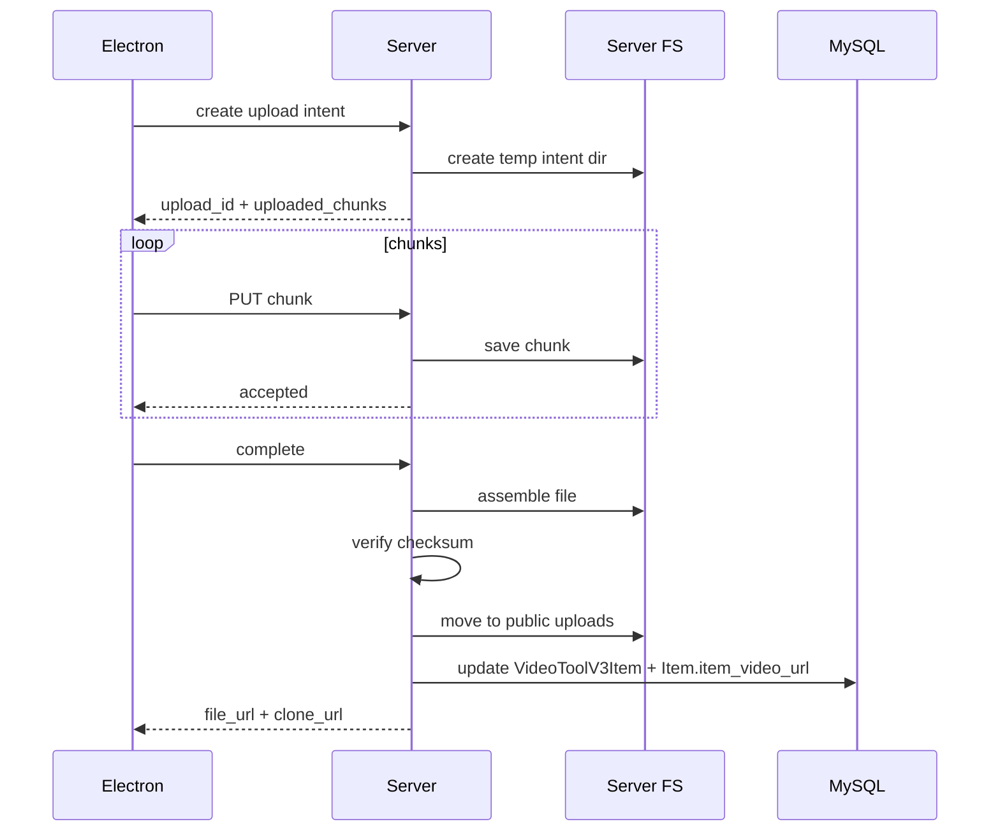
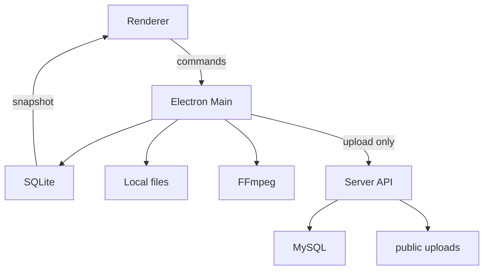

# Video Tool v3: diagrams

## 1. Общий flow

```mermaid
flowchart TD
  A["Открыть Video Tool"] --> B["Загрузить batch/items с сервера"]
  B --> C["Создать/открыть локальный project SQLite"]
  C --> D["Выбрать исходники"]
  D --> E["Prepare sources 720p/24fps"]
  E --> F["Монтаж segments"]
  F --> G["Создать local export run"]
  G --> H["Render item videos"]
  H --> I["Upload готовых outputs"]
  I --> J["Server обновляет Item.item_video_url"]
  J --> K["Проверка /clone/:serialNumber"]
```

## 2. Render/upload pipeline

```mermaid
flowchart LR
  A["Export item"] --> B["RENDER_ITEM job"]
  B --> C["FFmpeg render"]
  C --> D["Local output mp4"]
  D --> E["UPLOAD_ITEM job"]
  E --> F["Upload intent"]
  F --> G["Chunks"]
  G --> H["Complete"]
  H --> I["UPLOADED"]
```

## 3. Плохая сеть

```mermaid
flowchart TD
  A["Upload chunk"] --> B{"Network ok?"}
  B -- "yes" --> C["Continue chunks"]
  B -- "no" --> D["PAUSED_OFFLINE"]
  D --> E["Keep local output"]
  E --> F{"Network restored?"}
  F -- "yes" --> G["Resume intent"]
  G --> C
```

## 4. Restart recovery

```mermaid
flowchart TD
  A["App start"] --> B["Open SQLite"]
  B --> C["Find RUNNING jobs"]
  C --> D["Recover prepare/render/upload"]
  D --> E["Check files exist"]
  E --> F["Reconcile runs"]
  F --> G["Wake queue"]
```

## 5. Server upload intent

```mermaid
sequenceDiagram
  participant E as Electron
  participant S as Server
  participant FS as Server FS
  participant DB as MySQL

  E->>S: create upload intent
  S->>FS: create temp intent dir
  S-->>E: upload_id + uploaded_chunks
  loop chunks
    E->>S: PUT chunk
    S->>FS: save chunk
    S-->>E: accepted
  end
  E->>S: complete
  S->>FS: assemble file
  S->>S: verify checksum
  S->>FS: move to public uploads
  S->>DB: update VideoToolV3Item + Item.item_video_url
  S-->>E: file_url + clone_url
```

## 6. Источники истины

```mermaid
flowchart TD
  A["Renderer"] -->|"commands"| B["Electron Main"]
  B --> C["SQLite"]
  B --> D["Local files"]
  B --> E["FFmpeg"]
  B -->|"upload only"| F["Server API"]
  F --> G["MySQL"]
  F --> H["public uploads"]
  C -->|"snapshot"| A
```

